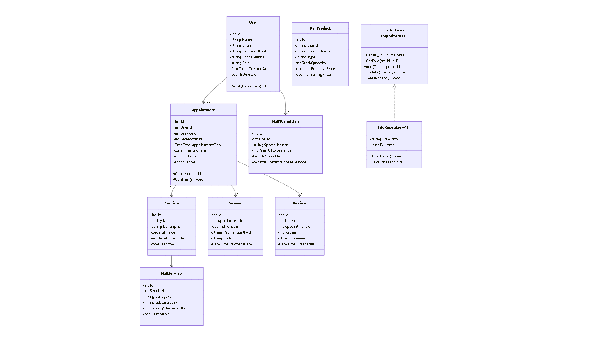

## 📊 Visual Class Diagram

---# 📚 Glow Book - Class Documentation

## 📋 Table of Contents
1. [Core Entities](#core-entities)
   - [User](#user)
   - [Service](#service)
   - [Appointment](#appointment)
   - [Payment](#payment)
   - [Review](#review)
2. [Nail Salon Specific Entities](#nail-salon-specific-entities)
   - [NailTechnician](#nailtechnician)
   - [NailService](#nailservice)
   - [NailArtDesign](#nailartdesign)
   - [AppointmentDetails](#appointmentdetails)
   - [NailProduct](#nailproduct)
   - [NailHealthRecord](#nailhealthrecord)
   - [PackageDeal](#packagedeal)
   - [NailColorChart](#nailcolorchart)
   - [AftercareInstruction](#aftercareinstruction)
   - [LoyaltyReward](#loyaltyreward)
   - [AuditLog](#auditlog)
3. [Repository Pattern](#repository-pattern)
   - [IRepository<T>](#irepositoryt)
   - [FileRepository<T>](#filerepositoryt)

---

## Core Entities

### User
**Description:** Represents a system user (client or staff member)

| Element | Details |
|---------|---------|
| **Access** | Public |
| **Namespace** | GlowBook.Core.Entities |

#### Attributes (Private)

| Attribute | Type | Description |
|-----------|------|-------------|
| `Id` | `int` | Unique identifier |
| `Name` | `string` | Full name of the user |
| `Email` | `string` | Email address (unique) |
| `PasswordHash` | `string` | Hashed password (BCrypt) |
| `PhoneNumber` | `string` | Contact phone number |
| `Role` | `UserRole` | User role (Customer/Staff/Admin) |
| `CreatedAt` | `DateTime` | Account creation date |
| `IsDeleted` | `bool` | Soft delete flag |

#### Methods (Public)

| Method | Return Type | Description |
|--------|-------------|-------------|
| `GetAll()` | `List<User>` | Returns all users |
| `GetById(int id)` | `User` | Returns user by ID |
| `Add(User user)` | `void` | Adds a new user |
| `Update(User user)` | `void` | Updates user information |
| `Delete(int id)` | `void` | Deletes user (soft delete) |
| `VerifyPassword(string password)` | `bool` | Verifies password hash |

#### Relationships
- **One-to-Many** with `Appointment` (a user can have many appointments)
- **One-to-Many** with `Review` (a user can write many reviews)
- **One-to-Many** with `NailHealthRecord` (a user can have many health records)
- **One-to-Many** with `LoyaltyReward` (a user can earn many rewards)
- **One-to-One** with `NailTechnician` (if user is a technician)

---

### Service
**Description:** Represents a nail service offered by the salon

| Element | Details |
|---------|---------|
| **Access** | Public |
| **Namespace** | GlowBook.Core.Entities |

#### Attributes (Private)

| Attribute | Type | Description |
|-----------|------|-------------|
| `Id` | `int` | Unique identifier |
| `Name` | `string` | Service name (e.g., "Gel Manicure") |
| `Description` | `string` | Detailed service description |
| `Price` | `decimal` | Service price in local currency |
| `DurationMinutes` | `int` | Duration in minutes |
| `IsActive` | `bool` | Whether service is currently offered |

#### Methods (Public)

| Method | Return Type | Description |
|--------|-------------|-------------|
| `GetAll()` | `List<Service>` | Returns all services |
| `GetById(int id)` | `Service` | Returns service by ID |
| `Add(Service service)` | `void` | Adds a new service |
| `Update(Service service)` | `void` | Updates service information |
| `Delete(int id)` | `void` | Deletes service |

#### Relationships
- **One-to-Many** with `Appointment` (a service can have many appointments)
- **One-to-One** with `NailService` (detailed nail service information)

---

### Appointment
**Description:** Represents a booked appointment

| Element | Details |
|---------|---------|
| **Access** | Public |
| **Namespace** | GlowBook.Core.Entities |

#### Attributes (Private)

| Attribute | Type | Description |
|-----------|------|-------------|
| `Id` | `int` | Unique identifier |
| `UserId` | `int` | Client ID (foreign key) |
| `ServiceId` | `int` | Service ID (foreign key) |
| `TechnicianId` | `int` | Technician ID (foreign key) |
| `AppointmentDate` | `DateTime` | Date and time of appointment |
| `EndTime` | `DateTime` | Calculated end time |
| `Status` | `AppointmentStatus` | Current status |
| `Notes` | `string` | Special instructions |
| `CreatedAt` | `DateTime` | Booking creation date |
| `IsDeleted` | `bool` | Soft delete flag |

#### Methods (Public)

| Method | Return Type | Description |
|--------|-------------|-------------|
| `GetAll()` | `List<Appointment>` | Returns all appointments |
| `GetById(int id)` | `Appointment` | Returns appointment by ID |
| `Add(Appointment appointment)` | `void` | Creates new appointment |
| `Update(Appointment appointment)` | `void` | Updates appointment |
| `Delete(int id)` | `void` | Cancels appointment |
| `Cancel()` | `void` | Changes status to Cancelled |
| `Confirm()` | `void` | Changes status to Confirmed |
| `Complete()` | `void` | Changes status to Completed |

#### Relationships
- **Many-to-One** with `User` (belongs to a client)
- **Many-to-One** with `Service` (belongs to a service)
- **Many-to-One** with `NailTechnician` (assigned to technician)
- **One-to-One** with `Payment` (has one payment)
- **One-to-One** with `Review` (has one review)
- **One-to-One** with `AppointmentDetails` (has detailed information)

---

### Payment
**Description:** Represents a payment transaction for an appointment

| Element | Details |
|---------|---------|
| **Access** | Public |
| **Namespace** | GlowBook.Core.Entities |

#### Attributes (Private)

| Attribute | Type | Description |
|-----------|------|-------------|
| `Id` | `int` | Unique identifier |
| `AppointmentId` | `int` | Appointment ID (foreign key) |
| `Amount` | `decimal` | Payment amount |
| `PaymentMethod` | `string` | Cash, Card, Mobile Payment |
| `Status` | `string` | Pending, Completed, Refunded |
| `PaymentDate` | `DateTime` | Date of payment |

#### Methods (Public)

| Method | Return Type | Description |
|--------|-------------|-------------|
| `GetAll()` | `List<Payment>` | Returns all payments |
| `GetById(int id)` | `Payment` | Returns payment by ID |
| `Add(Payment payment)` | `void` | Records a new payment |
| `Update(Payment payment)` | `void` | Updates payment information |
| `Delete(int id)` | `void` | Deletes payment record |
| `ProcessPayment()` | `bool` | Processes the payment |
| `Refund()` | `bool` | Processes refund |

#### Relationships
- **One-to-One** with `Appointment` (belongs to one appointment)

---

### Review
**Description:** Represents customer feedback for a completed appointment

| Element | Details |
|---------|---------|
| **Access** | Public |
| **Namespace** | GlowBook.Core.Entities |

#### Attributes (Private)

| Attribute | Type | Description |
|-----------|------|-------------|
| `Id` | `int` | Unique identifier |
| `UserId` | `int` | Client ID (foreign key) |
| `AppointmentId` | `int` | Appointment ID (foreign key) |
| `Rating` | `int` | Rating from 1 to 5 stars |
| `Comment` | `string` | Customer feedback text |
| `CreatedAt` | `DateTime` | Review submission date |

#### Methods (Public)

| Method | Return Type | Description |
|--------|-------------|-------------|
| `GetAll()` | `List<Review>` | Returns all reviews |
| `GetById(int id)` | `Review` | Returns review by ID |
| `Add(Review review)` | `void` | Adds a new review |
| `Update(Review review)` | `void` | Updates review |
| `Delete(int id)` | `void` | Deletes review |

#### Relationships
- **Many-to-One** with `User` (written by a user)
- **One-to-One** with `Appointment` (belongs to one appointment)

---

## Nail Salon Specific Entities

### NailTechnician
**Description:** Represents a nail technician/staff member

| Element | Details |
|---------|---------|
| **Access** | Public |
| **Namespace** | GlowBook.Core.Entities |

#### Attributes (Private)

| Attribute | Type | Description |
|-----------|------|-------------|
| `Id` | `int` | Unique identifier |
| `UserId` | `int` | Associated user account ID |
| `TechnicianNumber` | `string` | Unique staff ID (e.g., "MAN-001") |
| `Specialization` | `string` | Acrylic, Gel, Polygel, Dip Powder |
| `YearsOfExperience` | `int` | Years in the industry |
| `Certifications` | `string` | List of certifications |
| `Portfolio` | `string` | Link to portfolio |
| `IsAvailable` | `bool` | Currently available for appointments |
| `BaseSalary` | `decimal` | Monthly base salary |
| `CommissionPerService` | `decimal` | Commission percentage per service |

#### Methods (Public)

| Method | Return Type | Description |
|--------|-------------|-------------|
| `GetAll()` | `List<NailTechnician>` | Returns all technicians |
| `GetById(int id)` | `NailTechnician` | Returns technician by ID |
| `Add(NailTechnician technician)` | `void` | Adds a new technician |
| `Update(NailTechnician technician)` | `void` | Updates technician info |
| `Delete(int id)` | `void` | Deletes technician |
| `CalculateCommission(decimal servicePrice)` | `decimal` | Calculates commission earned |

#### Relationships
- **One-to-One** with `User` (linked to user account)
- **One-to-Many** with `Appointment` (assigned to many appointments)

---

### NailService
**Description:** Detailed information for nail-specific services

| Element | Details |
|---------|---------|
| **Access** | Public |
| **Namespace** | GlowBook.Core.Entities |

#### Attributes (Private)

| Attribute | Type | Description |
|-----------|------|-------------|
| `Id` | `int` | Unique identifier |
| `ServiceId` | `int` | Reference to base Service |
| `Category` | `string` | Manicure, Pedicure, Acrylic, Gel |
| `SubCategory` | `string` | French Tip, Ombre, 3D Art |
| `IncludedItems` | `List<string>` | Cuticle Care, Shaping, Polish |
| `AvailableColors` | `List<string>` | Available color options |
| `IsPopular` | `bool` | Popular service flag |
| `TimesBooked` | `int` | Number of times booked |

#### Methods (Public)

| Method | Return Type | Description |
|--------|-------------|-------------|
| `GetAll()` | `List<NailService>` | Returns all nail services |
| `GetById(int id)` | `NailService` | Returns nail service by ID |
| `Add(NailService nailService)` | `void` | Adds a new nail service |
| `Update(NailService nailService)` | `void` | Updates nail service |
| `Delete(int id)` | `void` | Deletes nail service |
| `IncrementBookings()` | `void` | Increases booking counter |

#### Relationships
- **One-to-One** with `Service` (extends base service)

---

### NailArtDesign
**Description:** Catalog of nail art designs offered

| Element | Details |
|---------|---------|
| **Access** | Public |
| **Namespace** | GlowBook.Core.Entities |

#### Attributes (Private)

| Attribute | Type | Description |
|-----------|------|-------------|
| `Id` | `int` | Unique identifier |
| `Name` | `string` | Design name |
| `Description` | `string` | Design description |
| `Complexity` | `string` | Simple, Medium, Complex |
| `AdditionalPrice` | `decimal` | Extra cost above base service |
| `EstimatedMinutes` | `int` | Additional time needed |
| `RequiredTools` | `List<string>` | Tools needed for design |
| `ImageUrls` | `List<string>` | Images of the design |
| `IsTrending` | `bool` | Trending design flag |

#### Methods (Public)

| Method | Return Type | Description |
|--------|-------------|-------------|
| `GetAll()` | `List<NailArtDesign>` | Returns all designs |
| `GetById(int id)` | `NailArtDesign` | Returns design by ID |
| `Add(NailArtDesign design)` | `void` | Adds a new design |
| `Update(NailArtDesign design)` | `void` | Updates design |
| `Delete(int id)` | `void` | Deletes design |

#### Relationships
- **One-to-Many** with `AppointmentDetails` (can be used in many appointments)

---

### AppointmentDetails
**Description:** Detailed nail-specific appointment information

| Element | Details |
|---------|---------|
| **Access** | Public |
| **Namespace** | GlowBook.Core.Entities |

#### Attributes (Private)

| Attribute | Type | Description |
|-----------|------|-------------|
| `Id` | `int` | Unique identifier |
| `AppointmentId` | `int` | Reference to appointment |
| `NailShape` | `NailShape` | Almond, Square, Coffin, etc. |
| `NailLength` | `NailLength` | Short, Medium, Long, Extra Long |
| `BaseColor` | `string` | Base color choice |
| `AccentColor` | `string` | Accent color choice |
| `NailArtDesignId` | `int` | Selected nail art design |
| `SpecialInstructions` | `string` | Customer special requests |
| `Allergies` | `List<string>` | Known allergies to products |
| `HasArtificialNails` | `bool` | Currently has artificial nails |
| `NeedsRemoval` | `bool` | Needs removal of current nails |
| `RemovalType` | `string` | Soak-off, File-off, E-file |

#### Methods (Public)

| Method | Return Type | Description |
|--------|-------------|-------------|
| `GetAll()` | `List<AppointmentDetails>` | Returns all appointment details |
| `GetById(int id)` | `AppointmentDetails` | Returns details by ID |
| `Add(AppointmentDetails details)` | `void` | Adds new appointment details |
| `Update(AppointmentDetails details)` | `void` | Updates details |
| `Delete(int id)` | `void` | Deletes details |

#### Relationships
- **One-to-One** with `Appointment` (belongs to one appointment)

---

### NailProduct
**Description:** Inventory management for nail products

| Element | Details |
|---------|---------|
| **Access** | Public |
| **Namespace** | GlowBook.Core.Entities |

#### Attributes (Private)

| Attribute | Type | Description |
|-----------|------|-------------|
| `Id` | `int` | Unique identifier |
| `Brand` | `string` | OPI, CND, Gelish, etc. |
| `ProductName` | `string` | Product name |
| `Type` | `string` | Polish, Gel, Acrylic Powder, Tool |
| `Color` | `string` | Color name |
| `ColorCode` | `string` | Manufacturer color code |
| `StockQuantity` | `int` | Current stock quantity |
| `LowStockThreshold` | `int` | Minimum stock alert level |
| `PurchasePrice` | `decimal` | Cost price |
| `SellingPrice` | `decimal` | Selling price |
| `ExpiryDate` | `DateTime` | Expiration date |
| `Supplier` | `string` | Supplier name |

#### Methods (Public)

| Method | Return Type | Description |
|--------|-------------|-------------|
| `GetAll()` | `List<NailProduct>` | Returns all products |
| `GetById(int id)` | `NailProduct` | Returns product by ID |
| `Add(NailProduct product)` | `void` | Adds new product |
| `Update(NailProduct product)` | `void` | Updates product info |
| `Delete(int id)` | `void` | Deletes product |
| `IsLowStock()` | `bool` | Checks if stock is low |
| `Restock(int quantity)` | `void` | Increases stock quantity |

---

### NailHealthRecord
**Description:** Customer nail health tracking

| Element | Details |
|---------|---------|
| **Access** | Public |
| **Namespace** | GlowBook.Core.Entities |

#### Attributes (Private)

| Attribute | Type | Description |
|-----------|------|-------------|
| `Id` | `int` | Unique identifier |
| `UserId` | `int` | Customer ID |
| `RecordDate` | `DateTime` | Date of record |
| `Condition` | `string` | Healthy, Brittle, Fungal, Damaged |
| `Notes` | `string` | Observations |
| `Recommendations` | `string` | Care recommendations |
| `TreatmentGiven` | `string` | Treatment provided |
| `NextCheckup` | `DateTime` | Recommended next checkup |
| `TechnicianId` | `int` | Technician who assessed |

#### Methods (Public)

| Method | Return Type | Description |
|--------|-------------|-------------|
| `GetAll()` | `List<NailHealthRecord>` | Returns all records |
| `GetById(int id)` | `NailHealthRecord` | Returns record by ID |
| `Add(NailHealthRecord record)` | `void` | Adds new health record |
| `Update(NailHealthRecord record)` | `void` | Updates record |
| `Delete(int id)` | `void` | Deletes record |

#### Relationships
- **Many-to-One** with `User` (belongs to a customer)

---

### PackageDeal
**Description:** Service packages and bundles

| Element | Details |
|---------|---------|
| **Access** | Public |
| **Namespace** | GlowBook.Core.Entities |

#### Attributes (Private)

| Attribute | Type | Description |
|-----------|------|-------------|
| `Id` | `int` | Unique identifier |
| `Name` | `string` | Package name |
| `Description` | `string` | Package description |
| `ServiceIds` | `List<int>` | List of service IDs included |
| `PackagePrice` | `decimal` | Total package price |
| `DiscountPercentage` | `decimal` | Discount percentage |
| `ValidityDays` | `int` | Days package is valid |
| `IsSeasonal` | `bool` | Seasonal package flag |
| `Season` | `string` | Summer, Winter, Wedding Season |

#### Methods (Public)

| Method | Return Type | Description |
|--------|-------------|-------------|
| `GetAll()` | `List<PackageDeal>` | Returns all packages |
| `GetById(int id)` | `PackageDeal` | Returns package by ID |
| `Add(PackageDeal package)` | `void` | Adds new package |
| `Update(PackageDeal package)` | `void` | Updates package |
| `Delete(int id)` | `void` | Deletes package |
| `CalculateSavings()` | `decimal` | Calculates savings vs individual |

---

### NailColorChart
**Description:** Available nail polish colors catalog

| Element | Details |
|---------|---------|
| **Access** | Public |
| **Namespace** | GlowBook.Core.Entities |

#### Attributes (Private)

| Attribute | Type | Description |
|-----------|------|-------------|
| `Id` | `int` | Unique identifier |
| `Brand` | `string` | Brand name |
| `Collection` | `string` | Collection name |
| `ColorName` | `string` | Color name |
| `ColorCode` | `string` | Manufacturer code |
| `HexCode` | `string` | Hex color code for display |
| `Category` | `string` | Red, Pink, Nude, Blue, etc. |
| `Finish` | `string` | Glossy, Matte, Glitter, Chrome |
| `IsInStock` | `bool` | Currently in stock |
| `SwatchImage` | `string` | Image URL of color swatch |
| `TimesUsed` | `int` | Usage counter |

#### Methods (Public)

| Method | Return Type | Description |
|--------|-------------|-------------|
| `GetAll()` | `List<NailColorChart>` | Returns all colors |
| `GetById(int id)` | `NailColorChart` | Returns color by ID |
| `Add(NailColorChart color)` | `void` | Adds new color |
| `Update(NailColorChart color)` | `void` | Updates color info |
| `Delete(int id)` | `void` | Deletes color |
| `IncrementUsage()` | `void` | Increases usage counter |

---

### AftercareInstruction
**Description:** Post-service care instructions

| Element | Details |
|---------|---------|
| **Access** | Public |
| **Namespace** | GlowBook.Core.Entities |

#### Attributes (Private)

| Attribute | Type | Description |
|-----------|------|-------------|
| `Id` | `int` | Unique identifier |
| `ServiceType` | `string` | Gel Manicure, Acrylic, etc. |
| `Title` | `string` | Instruction title |
| `Instructions` | `List<string>` | Step-by-step instructions |
| `DosAndDonts` | `string` | What to do and avoid |
| `DurationDays` | `int` | How long to follow |
| `RecommendedProducts` | `List<string>` | Recommended products |

#### Methods (Public)

| Method | Return Type | Description |
|--------|-------------|-------------|
| `GetAll()` | `List<AftercareInstruction>` | Returns all instructions |
| `GetById(int id)` | `AftercareInstruction` | Returns instruction by ID |
| `Add(AftercareInstruction instruction)` | `void` | Adds new instruction |
| `Update(AftercareInstruction instruction)` | `void` | Updates instruction |
| `Delete(int id)` | `void` | Deletes instruction |

---

### LoyaltyReward
**Description:** Customer loyalty rewards program

| Element | Details |
|---------|---------|
| **Access** | Public |
| **Namespace** | GlowBook.Core.Entities |

#### Attributes (Private)

| Attribute | Type | Description |
|-----------|------|-------------|
| `Id` | `int` | Unique identifier |
| `UserId` | `int` | Customer ID |
| `PointsEarned` | `int` | Points earned |
| `RewardType` | `string` | Free Service, Discount |
| `ServiceId` | `int` | Free service ID (if applicable) |
| `DiscountAmount` | `decimal` | Discount amount (if applicable) |
| `EarnedDate` | `DateTime` | When reward was earned |
| `ExpiryDate` | `DateTime` | Expiration date |
| `IsRedeemed` | `bool` | Whether reward was used |
| `RedeemedDate` | `DateTime` | When reward was redeemed |

#### Methods (Public)

| Method | Return Type | Description |
|--------|-------------|-------------|
| `GetAll()` | `List<LoyaltyReward>` | Returns all rewards |
| `GetById(int id)` | `LoyaltyReward` | Returns reward by ID |
| `Add(LoyaltyReward reward)` | `void` | Adds new reward |
| `Update(LoyaltyReward reward)` | `void` | Updates reward |
| `Delete(int id)` | `void` | Deletes reward |
| `IsValid()` | `bool` | Checks if reward is still valid |
| `Redeem()` | `void` | Marks reward as redeemed |

#### Relationships
- **Many-to-One** with `User` (belongs to a customer)

---

### AuditLog
**Description:** System audit trail for all actions

| Element | Details |
|---------|---------|
| **Access** | Public |
| **Namespace** | GlowBook.Core.Entities |

#### Attributes (Private)

| Attribute | Type | Description |
|-----------|------|-------------|
| `Id` | `int` | Unique identifier |
| `UserId` | `int` | User who performed action |
| `UserEmail` | `string` | User email for reference |
| `Action` | `string` | Create, Update, Delete, Login |
| `EntityType` | `string` | User, Appointment, Service, etc. |
| `EntityId` | `int` | ID of affected entity |
| `OldValue` | `string` | Previous value (JSON) |
| `NewValue` | `string` | New value (JSON) |
| `IpAddress` | `string` | User's IP address |
| `Timestamp` | `DateTime` | When action occurred |

#### Methods (Public)

| Method | Return Type | Description |
|--------|-------------|-------------|
| `GetAll()` | `List<AuditLog>` | Returns all audit logs |
| `GetById(int id)` | `AuditLog` | Returns log by ID |
| `Add(AuditLog log)` | `void` | Adds new audit entry |
| `GetByUser(int userId)` | `List<AuditLog>` | Returns logs for specific user |
| `GetByEntity(string entityType, int entityId)` | `List<AuditLog>` | Returns logs for specific entity |

---

## Repository Pattern

### IRepository<T>
**Description:** Generic repository interface

| Element | Details |
|---------|---------|
| **Access** | Public |
| **Type** | Interface |
| **Namespace** | GlowBook.Core.Interfaces |

#### Methods (Public)

| Method | Return Type | Description |
|--------|-------------|-------------|
| `GetAll()` | `IEnumerable<T>` | Returns all entities |
| `Find(Expression<Func<T, bool>> predicate)` | `IEnumerable<T>` | Finds entities matching predicate |
| `GetById(int id)` | `T` | Returns entity by ID |
| `Add(T entity)` | `void` | Adds new entity |
| `Update(T entity)` | `void` | Updates existing entity |
| `Delete(int id)` | `void` | Deletes entity by ID |

---

### FileRepository<T>
**Description:** CSV file-based repository implementation

| Element | Details |
|---------|---------|
| **Access** | Public |
| **Type** | Class |
| **Implements** | `IRepository<T>` |
| **Namespace** | GlowBook.Infrastructure.Repositories |

#### Attributes (Private)

| Attribute | Type | Description |
|-----------|------|-------------|
| `_filePath` | `string` | Path to CSV file |
| `_data` | `List<T>` | In-memory data cache |

#### Constructor

| Constructor | Description |
|-------------|-------------|
| `FileRepository(string filePath)` | Initializes repository with file path and loads data |

#### Methods (Public)

| Method | Return Type | Description |
|--------|-------------|-------------|
| `GetAll()` | `IEnumerable<T>` | Returns all entities from cache |
| `Find(Expression<Func<T, bool>> predicate)` | `IEnumerable<T>` | Filters entities by predicate |
| `GetById(int id)` | `T` | Finds entity by ID property |
| `Add(T entity)` | `void` | Adds entity, auto-generates ID |
| `Update(T entity)` | `void` | Updates entity and saves |
| `Delete(int id)` | `void` | Removes entity and saves |

#### Methods (Private)

| Method | Return Type | Description |
|--------|-------------|-------------|
| `LoadData()` | `void` | Reads CSV file and populates cache |
| `SaveData()` | `void` | Writes cache to CSV file |

---

## 📊 Entity Relationship Summary
